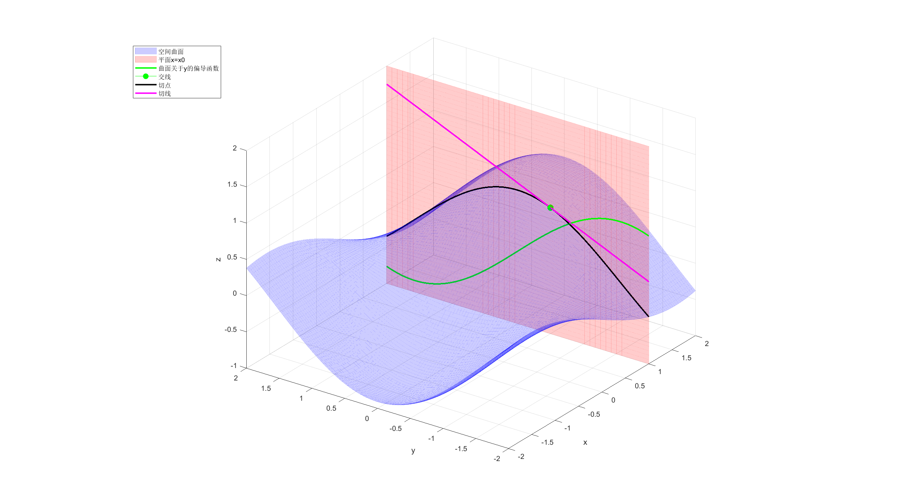
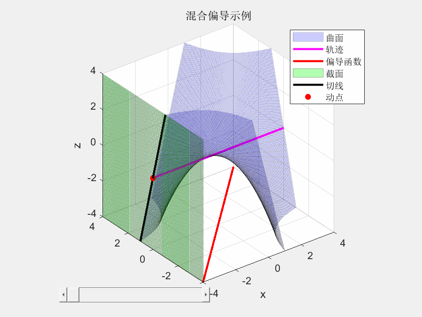

文件partial_derivative_y.m是一个空间曲线关于y的偏导的可视化\
涉及函数：

$$
f(x,y)=\sin{x}  \cos{y}
$$

涉及偏导函数：

$$
\frac{\partial f}{\partial y}=-\sin{x}\sin{y}
$$

涉及切点 $(1,-0.5)$ 及切线：

$$
z=-\sin{1}\cos{\frac{1}{2}}\big(y+\frac{1}{2}\big)
+\sin{1}\cos{\frac{1}{2}}
$$

文件mixed_partial_derivative.m是混合偏导的一个简单示例\
涉及函数：

$$
f(x)=xy
$$

涉及混合偏导：

$$
z=\frac{\partial^2{f}}{\partial{x}\partial{y}}=1
$$

*注：由于这个函数的特殊性， 这个动画看起来就像是截面与曲面的交线在移动，
而实际上是此曲面上一点的切线与截面和曲面的交线重合了， 
我实际表示的是切线而非交线。*

---
偏导数是空间曲面沿x方向或y方向的导数， 一般偏导函数的几何意义与一元导函数差不多，
可以简单地利用垂直于坐标轴的截面， 将偏导转化为截面与曲面所确定的曲线的导数。
而混合偏导所代表的几何意义较为抽象，其大致可以看作空间曲面上某一点沿某一方向
(x轴或y轴)的切线斜率沿另一方向的变化率。

从某种意义上看，偏导数可以看作方向导数的特殊情况。
