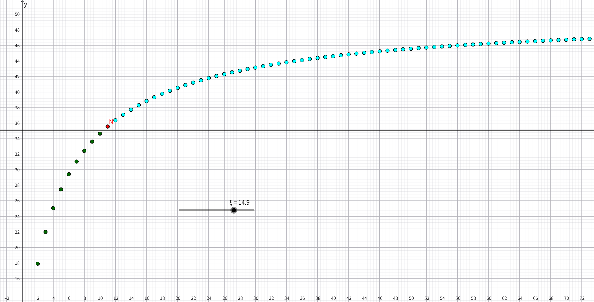
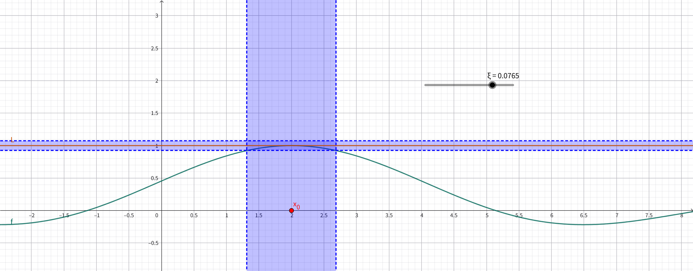
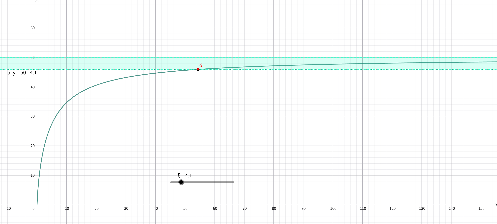

例1为 $\epsilon-N \ 定义$ 的简单实例

其中涉及的数列：

$$
a_n=5n\ln(\frac{10}{n}+1)
$$

例2为 $\varepsilon-\delta \ 定义$ 的简单实例

其中涉及的函数：

$$
f(x)=\frac{\sin(x-2)}{x-2}
$$

例3为 $\varepsilon-\delta \ 定义$ 的特殊情况，即 $x \to \infty$ 的情况\
其中涉及的函数:

$$
f(x)=5x\ln(\frac{10}{x}+1)
$$

---

**$\varepsilon-N \ 定义$**：

$$
\lim_{n \to \infty}{a_n}=L \Leftrightarrow \forall \varepsilon >0,\ 
\exists N \in \mathbb{N_+},\ \forall n >N:\ 
|a_n-L|<\varepsilon
$$

**$\varepsilon-\delta \ 定义$**：

$$
\lim_{x \to x_0}{f(x)} = L \Leftrightarrow 
\forall \varepsilon > 0,\ \exists \delta > 0,\ |x-x_0| < \delta : \ 
|f(x)-L| < \varepsilon
$$

例1也可以看做柯西序列的简单实例，但这个例子并不严谨，因为柯西序列并不通过极限值定义，而是通过项之间的距离描述。

**柯西序列**：

$$
\forall \varepsilon >0,\ 
\exists N \in \mathbb{N_+},\ \forall n,m >N:\ 
|a_n-a_m|<\varepsilon
$$

因此柯西序列并不总是等价于收敛数列，比如数列$\{1.4,1.41,1.414,...\}$收敛于
$\sqrt{2}$ ，在有理数系中它是柯西序列却不是收敛数列，因为 $\sqrt{2}$ 不在有理数系中，所以这个数列在有理数系上极限不存在。
例1并没有体现收敛数列与柯西序列的细微差别，但在实数系上这两个概念是等价的，
因此在实数系上例1可以作为柯西序列的例子展示。

