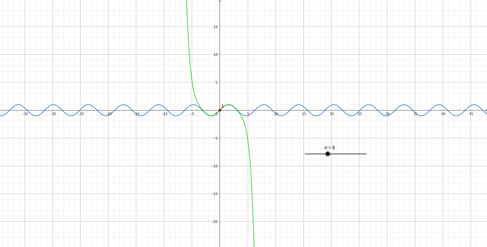

例1为一元泰勒公式的简单实例。\
其中涉及的函数：

$$
f(x)=\sin{x}
$$

及其在 $x=0$ 处的泰勒展开式，或称麦克劳林公式：

$$
\sin{x}=x-\frac{x^3}{3!}+\frac{x^5}{5!}+...
+\frac{(-1)^n}{n!}x^n+
o\big(x^n\big)
$$

或

$$
\sin{x}=x-\frac{x^3}{3!}+\frac{x^5}{5!}+...
+\frac{(-1)^n}{n!}x^n+\frac{\sin^{(n+1)}{(\xi)}}{(n+1)!}
x^{n+1}\ ,\ \xi \in [0,x]
$$

---
**泰勒公式**：

$$
f(x)=f(x_0)+\frac{f^{(2)}(x_0)}{2!}(x-x_0)^2+
\frac{f^{(3)}(x_0)}{3!}(x-x_0)^{3}+...
\frac{f^{(n)}(x_0)}{n!}(x-x_0)^{n}+\frac{f^{(n+1)}(\xi)}{(n+1)!}(x-x_0)^{n+1}
\ ,\ \xi \in [x_0,x]
$$

或

$$
f(x)=f(x_0)+\frac{f^{(2)}(x_0)}{2!}(x-x_0)^2+
\frac{f^{(3)}(x_0)}{3!}(x-x_0)^{3}+...
\frac{f^{(n)}(x_0)}{n!}(x-x_0)^{n}+o\big(x^n\big)
$$

其中， $\frac{f^{(n+1)}(\xi)}{(n+1)!}(x-x_0)^{n+1} $ 
为拉格朗日型余项，$o\big(x^n\big)$ 为皮亚诺型余项。

泰勒公式的几何意义是在函数上的某一点用多项式近似表示，
确切地说，是用函数的导数来近似。
而这涉及导数的几何意义， 每一阶导数都关系函数图像的一个几何信息。
比如， 一阶导数代表函数切线的斜率； 二阶导数代表切线斜率的变化率，即曲率；
三阶导数代表曲率的变化率， 更高阶以此类推。 越高阶的导数代表的信息越抽象，
因此无法在图像上直观地展示。
两个函数在某一点的某一阶导数相等即意味着两个函数的一个几何信息相等，
相等的导数越多， 两个函数在这一点的图像就越相近。
因此， 展开的项数越多近似的精度越高，
同时使用泰勒公式的条件是**导数存在**，具体可以展开到第几项则取决于函数的**最高阶导数**，
比如，$f(x)$ 的最高阶导数为n阶导数，则带拉格朗日型余项时最高可以泰勒展开到第n-1项，
带皮亚诺型余项时可以泰勒展开到第n项。
带拉格朗日型余项的多项式近似精度比带皮亚诺型余项的多项式高。

需要注意的是， *泰勒多项式的近似范围仅在**指定点**上*， 它无法近似整个函数。

当展开项数有限时， 称展开式为**泰勒多项式**；
当展开项数无限时， 称展开式为**泰勒级数**；
当指定点为0，即 $x_0=0$ 时， 称此公式为**麦克劳林公式**。

