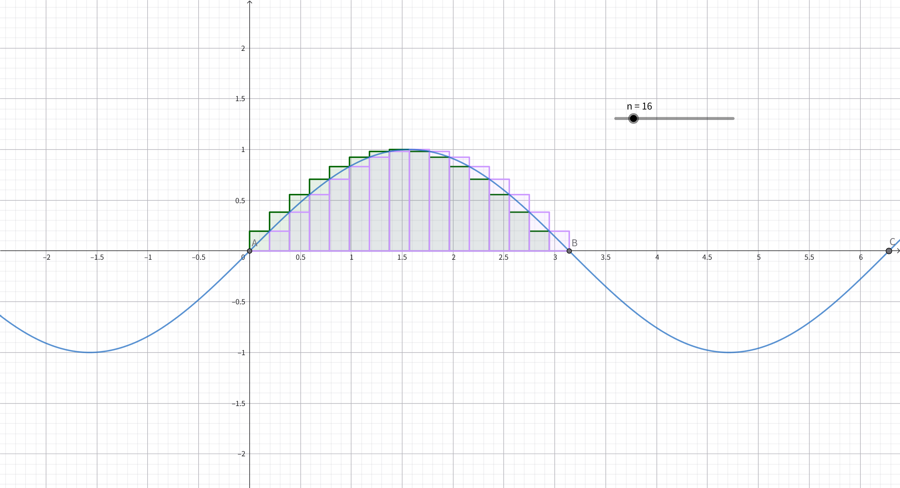
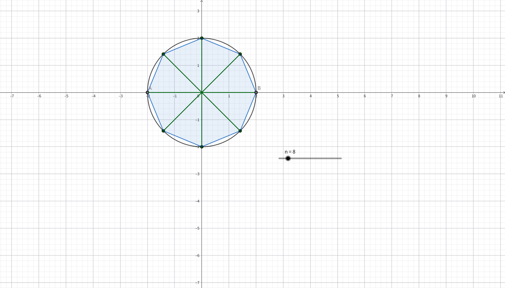

例1为一元黎曼和的简单实例,包含左和与右和\
其中涉及的函数：

$$
f(x)=\sin{x}
$$

例2为二元黎曼和在二维平面上的简单实例\
其中涉及的函数：

$$
f(x)=\begin{cases}
x^2+y^2,\\
z=0
\end{cases}
$$

---
黎曼和：

$$
S=\sum_{i=1}^{n}f(\xi_i)\, \Delta x_i
$$

其中， $f(x)$ 在 $[a,b]$ 上有定义，
则对 $[a,b]$ 进行划分，$\Delta x_i$为第i个子区域的长度，
$\xi_i$为第i个子区间的任意一点。

黎曼和的维数仅与分割区域的维数有关，分割区域为一维，其上的黎曼和即为一元黎曼和。
